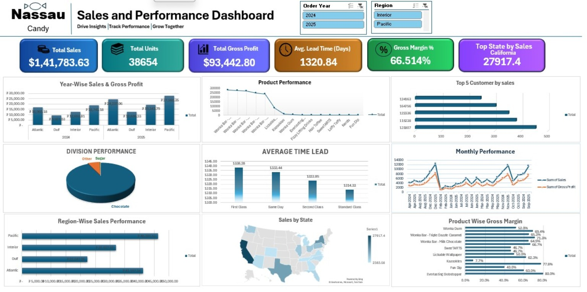
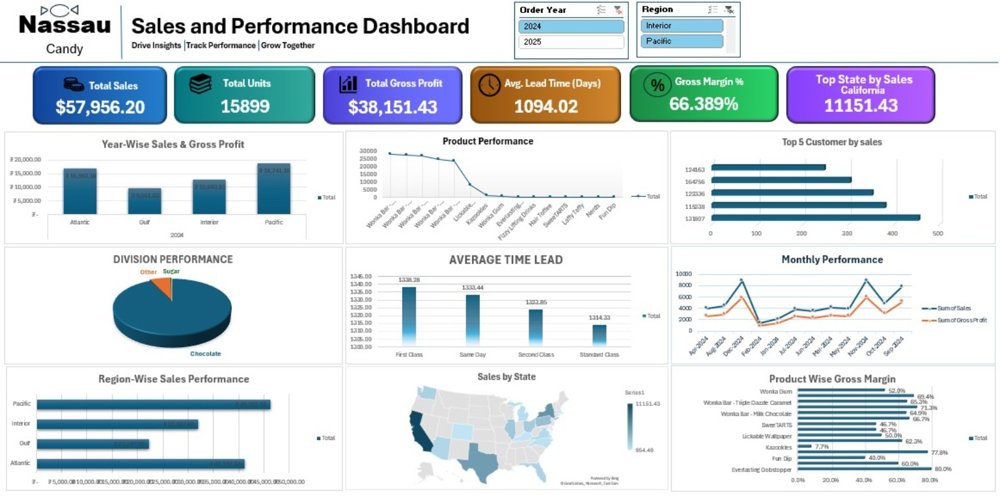
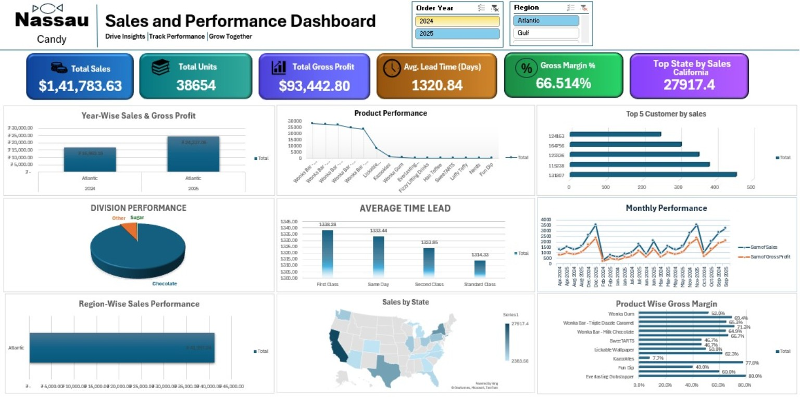
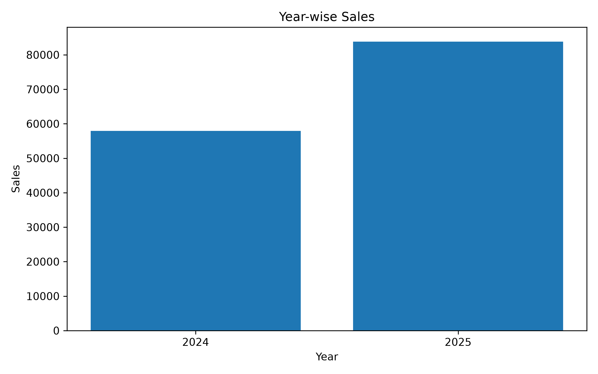
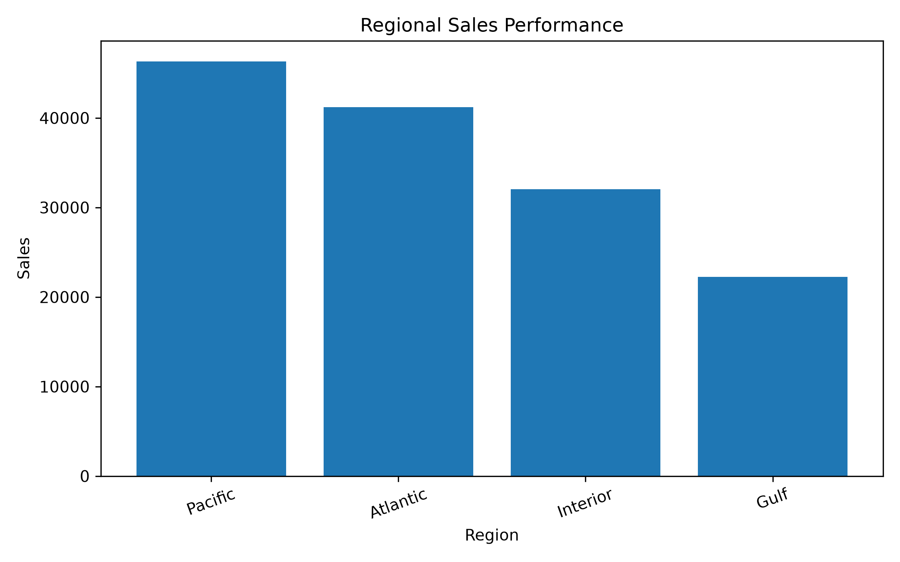
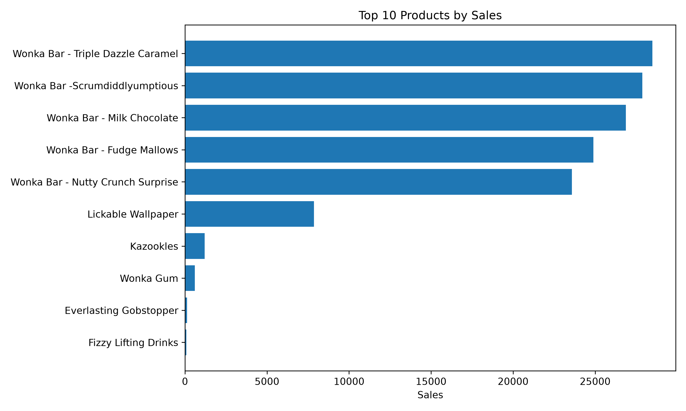
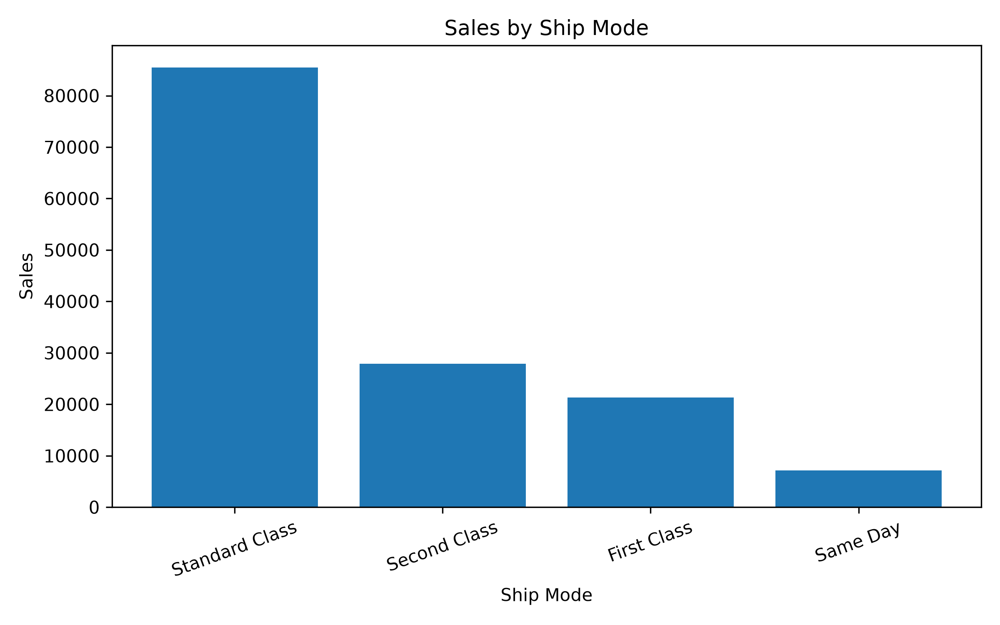

# 🍬 Nassau Candy Data Analysis

### Sales Analytics • Business Insights • Data Visualization

 

 

**Turning raw sales data into meaningful business insights through structured analysis and visualization.**

---

<table>
<tr>

<td align="center" width="25%">

### 📊
**Data Analysis**

Sales & Business Insights

</td>

<td align="center" width="25%">

### 📦
**Product Analysis**

Product Performance

</td>

<td align="center" width="25%">

### 👥
**Customer Analysis**

Customer Insights

</td>

<td align="center" width="25%">

### 🌎
**Regional Analysis**

Geographic Performance

</td>

</tr>
</table>

---

## 📌 Project Overview

The **Nassau Candy Data Analysis** project focuses on analyzing sales, profitability, customer, product, regional, and operational performance using a real-world candy distribution dataset.

The project transforms raw transactional data into structured analysis and an interactive dashboard to identify important business patterns, performance trends, and key business insights.

---

## 🧰 Dataset & Tools Used

<table>
<tr>

<td align="center" width="50%">

### 📁 Dataset

**Nassau Candy Distributor.csv**

**10,194 Records**

</td>

<td align="center" width="50%">

### 🛠️ Tools Used

**Microsoft Excel**

**Python**

**Pandas**

**Matplotlib**

**GitHub**

</td>

</tr>
</table>

> **Note:** The Excel sheet contains 10,195 rows including the header row. Therefore, the dataset contains 10,194 actual records.

---

## 🔄 Analysis Workflow

<table>
<tr>

<td align="center">

### 01
**Raw Data**

</td>

<td align="center">→</td>

<td align="center">

### 02
**Data Preparation**

</td>

<td align="center">→</td>

<td align="center">

### 03
**Pivot Analysis**

</td>

<td align="center">→</td>

<td align="center">

### 04
**Visualization**

</td>

<td align="center">→</td>

<td align="center">

### 05
**Business Insights**

</td>

</tr>
</table>

---

## 🧹 Data Preparation

<table>
<tr>

<td align="center" width="33%">

### 🧹

**Data Cleaning**

Prepared and cleaned the raw dataset for analysis.

</td>

<td align="center" width="33%">

### 🔍

**Data Validation**

Checked missing values and duplicate records.

</td>

<td align="center" width="33%">

### 📅

**Date Preparation**

Prepared order and shipping dates for time-based analysis.

</td>

</tr>

<tr>

<td align="center" width="33%">

### ⏱️

**Lead Time**

Calculated shipping lead time using order and ship dates.

</td>

<td align="center" width="33%">

### 🧮

**Calculated Fields**

Created required calculated fields for analysis.

</td>

<td align="center" width="33%">

### 📊

**Pivot Analysis**

Created structured pivot tables for business analysis.

</td>

</tr>
</table>

---

## 📊 Analysis Areas

<table>
<tr>

<td align="center" width="50%">

### 💰 Sales & Financial Analysis

**Sales**  
**Units**  
**Gross Profit**  
**Cost**  
**Gross Margin**

</td>

<td align="center" width="50%">

### 📦 Product Performance

**Product Sales**  
**Product Units**  
**Gross Profit**  
**Gross Margin**

</td>

</tr>

<tr>

<td align="center" width="50%">

### 👥 Customer Performance

**Customer Sales**  
**Top Customers**  
**Sales Contribution**

</td>

<td align="center" width="50%">

### 🌎 Regional & Operational Analysis

**Region Performance**  
**State Performance**  
**Division Performance**  
**Lead Time Analysis**

</td>

</tr>
</table>

---

## 📈 Dashboard

<table>
<tr>

<td align="center" width="33%">

### 💳 KPI Cards

**Total Sales**  
**Total Units**  
**Total Gross Profit**  
**Average Lead Time**  
**Gross Margin**  
**Top State by Sales**

</td>

<td align="center" width="33%">

### 🎛️ Filters

**Year**  
**Region**

</td>

<td align="center" width="33%">

### 📊 Visual Analysis

**Year-wise Performance**  
**Product Performance**  
**Customer Performance**  
**Regional Performance**

</td>

</tr>
</table>

### 📌 Dashboard Features

<table>
<tr>
<td align="center"><b>🎛️ Year & Region Slicers</b></td>
<td align="center">Interactive filtering</td>
</tr>

<tr>
<td align="center"><b>📈 Year-wise Sales & Gross Profit</b></td>
<td align="center">Yearly performance</td>
</tr>

<tr>
<td align="center"><b>📦 Product Performance</b></td>
<td align="center">Product-level analysis</td>
</tr>

<tr>
<td align="center"><b>👥 Top 5 Customers</b></td>
<td align="center">Customer contribution</td>
</tr>

<tr>
<td align="center"><b>🏢 Division Performance</b></td>
<td align="center">Division comparison</td>
</tr>

<tr>
<td align="center"><b>⏱️ Average Lead Time</b></td>
<td align="center">Operational performance</td>
</tr>

<tr>
<td align="center"><b>📅 Monthly Performance</b></td>
<td align="center">Monthly trends</td>
</tr>

<tr>
<td align="center"><b>🌎 Region-wise Sales</b></td>
<td align="center">Regional comparison</td>
</tr>

<tr>
<td align="center"><b>📍 Sales by State</b></td>
<td align="center">Geographic analysis</td>
</tr>

<tr>
<td align="center"><b>💹 Product-wise Gross Margin</b></td>
<td align="center">Product profitability</td>
</tr>

</table>

---

## 🖼️ Dashboard Preview

### 📊 Interactive Sales & Business Performance Dashboard

 

  

 

<table>
<tr>

<td align="center" width="50%">

### 📅 2024 Dashboard

</td>

<td align="center" width="50%">

### 🌎 2024 Dashboard — Atlantic & Gulf

</td>

</tr>
</table>

 

### 📈 2025 Dashboard

---

## 🐍 Python Analysis

Python was used to perform additional data analysis and identify shipping optimization candidates without changing the existing Excel dashboard.

### Key Python Analysis

- Data quality validation
- Year-wise sales analysis
- Region-wise performance analysis
- Ship-mode analysis
- Product performance analysis
- State-level analysis
- Lead-time analysis
- Gross-margin analysis
- Shipping optimization candidate identification

### 📊 Key Python Results

<table>
<tr>

<td align="center" width="50%">

**Total Records**

10,194

</td>

<td align="center" width="50%">

**Total Sales**

$141,783.63

</td>

</tr>

<tr>

<td align="center" width="50%">

**Total Units**

38,654

</td>

<td align="center" width="50%">

**Total Gross Profit**

$93,442.80

</td>

</tr>

<tr>

<td align="center" width="50%">

**Total Cost**

$48,340.83

</td>

<td align="center" width="50%">

**Average Lead Time**

1,320.84 days

</td>

</tr>

<tr>

<td align="center" width="50%">

**Average Gross Margin**

66.51%

</td>

<td align="center" width="50%">

**Top Region by Sales**

Pacific

</td>

</tr>

<tr>

<td align="center" width="50%">

**Top State by Sales**

California

</td>

<td align="center" width="50%">

**Top Product by Sales**

Wonka Bar - Triple Dazzle Caramel

</td>

</tr>

</table>

### 📅 Year-wise Sales

**2024:** $57,956.20

**2025:** $83,827.43

### 📈 Python Visualizations

### 🚚 Shipping Optimization

High-value product–state combinations with comparatively high lead times were identified for further factory assignment or shipping-route review.

> **Note:** The current dataset does not contain factory location, factory capacity, existing factory-assignment, or actual shipping-distance data. Therefore, the analysis identifies potential candidates for further investigation rather than making a definitive factory relocation recommendation.

---

## 💡 Business Insight Areas

<table>
<tr>

<td align="center" width="50%">

### 💰 Revenue

Identify sales trends and high-performing periods.

</td>

<td align="center" width="50%">

### 📦 Products

Identify products contributing significantly to sales and profit.

</td>

</tr>

<tr>

<td align="center" width="50%">

### 👥 Customers

Understand major customer contributions to overall sales.

</td>

<td align="center" width="50%">

### 🌎 Regions

Compare regional and state-level business performance.

</td>

</tr>
</table>

---

## 🎯 Project Objective

The primary objective of this project is to transform raw sales data into meaningful business insights through structured data preparation, analysis, and visualization.

<table>
<tr>

<td align="center">💰 Sales Performance</td>
<td align="center">📈 Profitability</td>
<td align="center">📦 Product Contribution</td>

</tr>

<tr>

<td align="center">👥 Customer Contribution</td>
<td align="center">🌎 Regional Performance</td>
<td align="center">⏱️ Operational Lead Time</td>

</tr>
</table>

---

## 📂 Project Structure

<table>
<tr>

<td align="center">

📄 **Nassau Candy Distributor.csv**

</td>

<td align="center">

🐍 **nassau_analysis.py**

</td>

<td align="center">

📊 **Nassau_Python_Analysis.xlsx**

</td>

</tr>

<tr>

<td align="center">

🚚 **Nassau_Shipping_Optimization_Candidates.xlsx**

</td>

<td align="center">

📝 **README.md**

</td>

<td align="center">

📊 **Excel Dashboard**

</td>

</tr>

</table>

---

## 🧠 Skills Demonstrated

 

  

**Analytical Skills • Critical Thinking • Decision Making • Active Listening • Adaptability • Project Management**

---

## 🎓 Certifications

<table>
<tr>

<td align="center" width="50%">

<h3>🏆 Microsoft Power BI</h3>

<b>Certified Microsoft Power BI Professional</b>

<i>Himalaya Upskilling & Research Center</i>

</td>

<td align="center" width="50%">

<h3>🤖 AI Fluency</h3>

<b>AI Fluency: Framework & Foundations</b>

<i>Anthropic</i>

</td>

</tr>

<tr>

<td align="center" width="50%">

<h3>📊 Data Mining & Business Analytics</h3>

<b>Data Mining & Business Analytics</b>

<i>NPTEL SWAYAM</i>

</td>

<td align="center" width="50%">

<h3>📄 Getting Started with Data</h3>

<b>Getting Started with Data</b>

<i>IBM SkillsBuild</i>

</td>

</tr>

<tr>

<td align="center" width="50%">

<h3>🤖 AI Fundamentals</h3>

<b>AI Fundamentals: Foundations for Understanding AI</b>

<i>IBM SkillsBuild</i>

</td>

<td align="center" width="50%">

<h3>🧠 QuizOff 2026</h3>

<b>QuizOff 2026: India's Biggest AI Quiz</b>

CampusCrew × Unstop

<i>Participation Certificate — July 2026</i>

</td>

</tr>

</table>

---

## 👨‍💻 About Me

# Aditya Gupta

### Data Analyst | Business Analyst

Passionate about transforming data into meaningful insights and supporting data-driven business decisions.

---

## 🚀 Career Focus

 

---

### ⭐ Thank You for Visiting

**Nassau Candy Data Analysis Project**

*Made with Data • Analysis • Curiosity*

 

**© Aditya Gupta**

